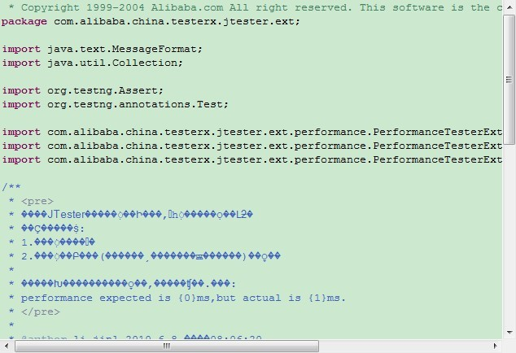
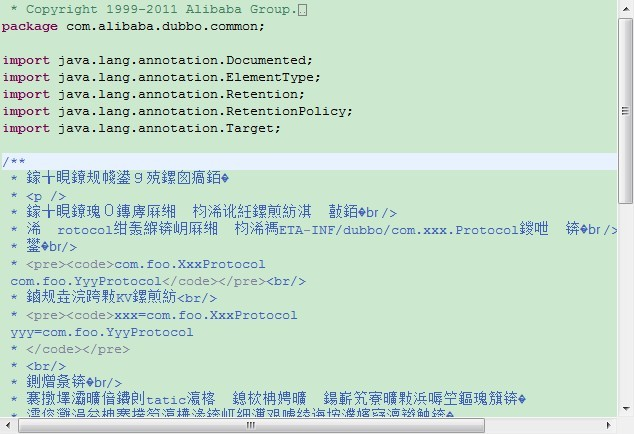
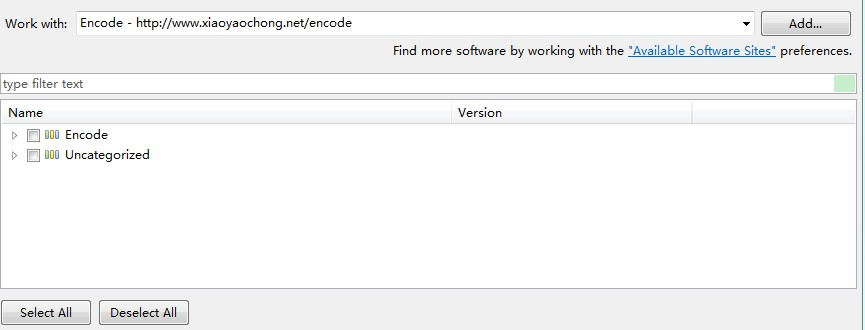

##遇到的问题

在同一个工作区下，依赖的Jar包如果既有GBK编码，又有UTF-8编码，就会出现的问题。

场景一：如果设置工作区为UTF-8编码来查看GBK编码的Jar包，可以显示正确的中文文字，但是查看GBK编码的Jar包，就会显示乱码。

场景二：反过来，如果设置工作区为GBK编码来查看UTF-8编码的Jar包，则查看UTF-8编码的Jar包，就会显示乱码。

##常规解决方法

1、切换工作区编码。麻烦，效率低。

2、设置Jar包编码，只有Eclipse4.2支持，4.0以下版本不支持，并且时行式不行，存在bug。

##插件解决方法

插件在Eclipse浏览源码的编辑器上添加了菜单项，开发者可以指定具体的二进制编码来纠正乱码。

场景一：GBK编码的Jar包，在UTF-8编码的工作区下显示乱码，则只需要右键菜单Encode For GBK，或者按快捷键<Shift + Alt + K>（1.0.3版本快捷键更新）。

场景二：UTF-8编码的Jar包，在GBK编码的工作区下显示乱码，则只需要右键菜单Encode For UTF-8，或者按快捷键<Shift + Alt + F8>。

##插件安装方法

Help菜单项，选择Instance New Software，Update Site URL地址： http://www.xiaoyaochong.net/encode

注意

目前该插件只处理源码编辑器（Class File Editor）的问题，其他编辑器和视图暂不支持。
